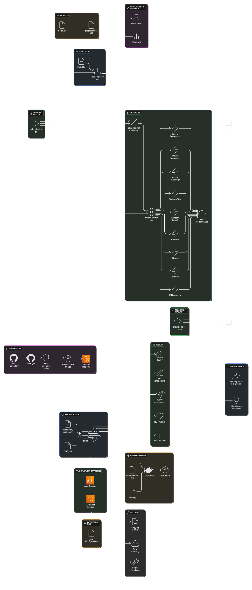

# Student Performance Prediction - Production-Grade MLOps Pipeline

Enterprise-level machine learning system implementing comprehensive MLOps practices with automated CI/CD pipelines, containerized microservices architecture, and cloud-native deployment strategies. Features production-ready model serving, automated model retraining, and infrastructure-as-code deployment patterns.

## 🏛️ System Architecture



## 🎯 Project Overview

This project predicts student math performance using features like:
- Gender
- Race/Ethnicity 
- Parental level of education
- Lunch type (standard/free or reduced)
- Test preparation course completion
- Reading and writing scores

## 🏗️ Project Architecture

```
ETE-project-3/
├── src/                            # Source code
│   ├── components/                 # ML pipeline components
│   │   ├── data_ingestion.py       # Data loading and splitting
│   │   ├── data_transformation.py  # Feature engineering
│   │   └── model_trainer.py        # Model training and evaluation
│   ├── pipeline/                   # Prediction pipelines
│   │   ├── predict_pipeline.py     # Inference pipeline
│   │   └── train_pipeline.py       # Training pipeline
│   ├── exception.py                # Custom exception handling
│   ├── logger.py                   # Logging configuration
│   └── utils.py                    # Utility functions
├── notebook/                       # Jupyter notebooks
│   ├── EDA.ipynb                   # Exploratory Data Analysis
│   ├── Model.ipynb                 # Model experimentation
│   ├── data/stud.csv               # Dataset
│   ├── plots/                      # Visualization outputs
│   └── savedmodel/                 # Trained models
├── artifacts/                      # Generated artifacts
│   ├── model.pkl                   # Final trained model
│   ├── preprocessor.pkl            # Data preprocessor
│   └── *.csv                       # Processed datasets
├── templates/                      # HTML templates
├── static/                         # CSS/JS files
├── logs/                           # Application logs
├── app.py                          # Flask web application
├── Dockerfile                      # Container configuration
├── requirements.txt                # Python dependencies
└── setup.py                        # Package setup
```

## 🚀 Technical Architecture

- **Production ML Pipeline**: Automated ETL, feature engineering, model training with hyperparameter optimization
- **Microservices Architecture**: Flask-based REST API with containerized deployment
- **Multi-Model Evaluation**: Ensemble methods with cross-validation and automated model selection
- **Observability Stack**: Structured logging, metrics collection, and distributed tracing
- **Container Orchestration**: Docker containerization with multi-stage builds
- **GitOps Workflow**: Infrastructure-as-code with automated CI/CD pipelines
- **Cloud-Native Design**: Scalable, stateless services with horizontal scaling capabilities

## 📊 Models Evaluated

- Linear Regression
- Ridge Regression
- Lasso Regression
- Decision Tree Regressor
- Random Forest Regressor
- AdaBoost Regressor
- XGBoost Regressor
- CatBoost Regressor
- K-Neighbors Regressor

## 🛠️ Installation & Setup

### Prerequisites
- Python 3.12+
- pip
- Docker 

### Local Setup

1. **Clone the repository**
   ```bash
   git clone <repository-url>
   cd ETE-project-3
   ```

2. **Create virtual environment**
   ```bash
   python -m venv venv
   source venv/bin/activate  # On Windows: venv\Scripts\activate
   ```

3. **Install dependencies**
   ```bash
   pip install -r requirements.txt
   ```

4. **Install package in development mode**
   ```bash
   pip install -e .
   ```

### Docker Setup

1. **Build Docker image**
   ```bash
   docker build -t student-performance-app .
   ```

2. **Run container**
   ```bash
   docker run -p 8080:8080 student-performance-app
   ```

## 🎮 Usage

### Training the Model

```bash
python src/components/data_ingestion.py
```

### Running the Web Application

```bash
python app.py
```

Access the application at `http://localhost:8080`

### Making Predictions

The web interface allows you to:
1. Select student demographics
2. Enter reading and writing scores
3. Get predicted math score

## 📈 Model Performance

The final model selection is based on:
- R² Score
- Mean Absolute Error (MAE)
- Root Mean Square Error (RMSE)

Detailed performance metrics are available in the training logs.

## ⚙️ Infrastructure Configuration

### Environment Variables
```bash
# AWS Infrastructure
AWS_ACCESS_KEY_ID=<access_key>
AWS_SECRET_ACCESS_KEY=<secret_key>
AWS_REGION=us-east-1
ECR_REPOSITORY_NAME=student-performance
AWS_ECR_LOGIN_URI=<account_id>.dkr.ecr.us-east-1.amazonaws.com


### Directory Structure
```
artifacts/          # Model artifacts and preprocessors
logs/              # Application and system logs
notebook/data/     # Training datasets
static/           # Frontend assets
templates/        # Jinja2 templates
```

## 🚀 CI/CD Pipeline & Deployment Architecture

### GitHub Actions Workflow

```yaml
# .github/workflows/main.yml
name: MLOps Production Pipeline

on:
  push:
    branches: [main]
    paths-ignore: ['README.md']

jobs:
  continuous-integration:
    runs-on: ubuntu-latest
    steps:
      - name: Code Quality Gates
        run: |
          echo "Static code analysis"
          echo "Security vulnerability scanning"
          echo "Unit test execution"
          echo "Integration test suite"
```

### Container Orchestration

**Multi-stage Dockerfile:**
```dockerfile
FROM python:3.12.5-slim-bookworm
WORKDIR /app
COPY . /app

# System dependencies
RUN apt update -y && apt install awscli -y

# Python dependencies
RUN pip install -r requirements.txt
CMD ["python3", "app.py"]
```

### Production Deployment Strategies

#### 1. AWS ECS + ECR (Recommended)
```bash
# Build and push to ECR
docker build -t student-performance .
docker tag student-performance:latest $ECR_URI:latest
docker push $ECR_URI:latest

# Deploy to ECS
aws ecs update-service --cluster production --service student-performance-service
```

#### 2. AWS EC2 Auto Scaling
```bash
# Pull latest image
docker pull $ECR_URI:latest

# Zero-downtime deployment
docker run -d -p 8080:8080 \
  --name student-performance \
  --restart unless-stopped \
  -e AWS_ACCESS_KEY_ID=$AWS_ACCESS_KEY_ID \
  -e AWS_SECRET_ACCESS_KEY=$AWS_SECRET_ACCESS_KEY \
  $ECR_URI:latest
```

## 📡 REST API Specification

### Core Endpoints

```http
GET /health
Content-Type: application/json
Response: {"status": "healthy", "timestamp": "2024-01-01T00:00:00Z"}

GET /metrics
Content-Type: text/plain
Response: Prometheus metrics format

GET /
Content-Type: text/html
Response: Application landing page

GET /predictdata
Content-Type: text/html
Response: Prediction form interface

POST /predictdata
Content-Type: application/x-www-form-urlencoded
Payload: {
  "gender": "male|female",
  "ethnicity": "group A|B|C|D|E",
  "parental_level_of_education": "string",
  "lunch": "standard|free/reduced",
  "test_preparation_course": "none|completed",
  "reading_score": "float[0-100]",
  "writing_score": "float[0-100]"
}
Response: {"prediction": float, "confidence": float}
```


## 📊 Data Schema

| Feature | Type | Description |
|---------|------|-------------|
| gender | categorical | Student gender (male/female) |
| race_ethnicity | categorical | Race/ethnicity group (A-E) |
| parental_level_of_education | categorical | Parent education level |
| lunch | categorical | Lunch type (standard/free or reduced) |
| test_preparation_course | categorical | Test prep completion (none/completed) |
| reading_score | numerical | Reading test score (0-100) |
| writing_score | numerical | Writing test score (0-100) |
| math_score | numerical | **Target**: Math test score (0-100) |


